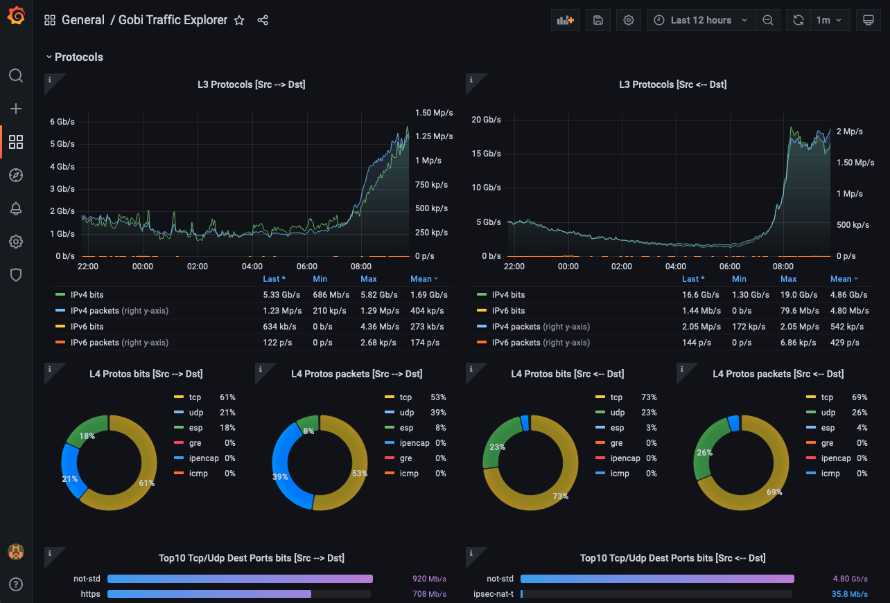

# Gobi

[](https://pkg.go.dev/github.com/automixer/gobi)
[](https://opensource.org/licenses/BSD-3-Clause)
[](https://goreportcard.com/report/github.com/automixer/gobi)

This application allows you to visualize the highly complex flow Information data exported by network devices, in an easy and understandable graphical way. 

It takes a decoded flow data stream from [GoFlow2](https://github.com/netsampler/goflow2) as input and exports it to [Prometheus Server](https://github.com/prometheus/prometheus) to be stored. Then, data can be queried and graphically represented using tools such as [Grafana.](https://github.com/grafana/grafana)

## Project Goals

Gobi aims to be a fast, lightweight and easy to use tool for network flows analysis. It favours speed over absolute accuracy. With Gobi, flows are pre-processed and aggregated before getting stored to the DB. The subsequent data visualization operations are therefore greatly improved, allowing short response times even over large analysis intervals.

## Get Started

The [examples](examples) folder contains two ready to deploy Gobi setups, one for docker-compose and the other for kubernetes environment. Pick one and send to it a NetFlow/IPFIX stream to get a sample of what Gobi can do. [Here](examples/README.md) you can find detailed installation instructions.



## Setup a basic flow pipeline

To set up a basic flow pipeline, download Gobi and GoFlow2 to your local machine and create a `gobi.yml` config file like this template:

> ```
> global:
>   metricsaddr: :9310
> 
> producer:
>   input: stdin
> 
> promexporters:
>   - metricsname: example
>     labelset: ["SamplerAddress"]
> ```

Then start the pipeline with the following command:

```
$ ./goflow2 -transport.file.sep= -format=pb -format.protobuf.fixedlen=true | ./gobi -f gobi.yml
```

 The pipeline is now ready to be scraped by Prometheus server at the IP address of your local machine. A full config keys list supported by `gobi.yml` is available [here](./doc/CONFIG-GUIDE.md). The provided [examples](./examples/README.md) are a good starting point for Gobi deployments.

## Application design

Gobi is modular. The `producer` receives input flow data, converts it in go structures, enriches it with extended infos and outputs to a set of registered `exporter` instances. Each `exporter` can then shape its data as needed and output it in the the desired format. The current Gobi implementation features a GoFlow2 `producer` and a Prometheus `exporter`.

### The GoFlow2 producer

It takes its input from stdin or a named pipe. The expected format is GPB, as defined by GoFlow2 proto [file](https://github.com/netsampler/goflow2/blob/v1.1.0/pb/flow.proto) *(not all fields are currently exported)*. Each flow is then enriched with data coming from these popular DBs:

* MaxMind [GeoLite2 Country](https://dev.maxmind.com/geoip/geolite2-free-geolocation-data?lang=en).
* MaxMind [GeoLite2 ASN](https://dev.maxmind.com/geoip/docs/databases/asn?lang=en).
* [TheDiveO](https://github.com/thediveo/netdb) netdb.

Finally, a copy of this enriched flow is sent to each registered exporter for further processing.

### The Prometheus exporter

Flows coming from `producer` are initially stored in a memory buffer, waiting for a Prometheus server scrape event. When scraping happens, `promexporter` checks them out and process flows it as follows:

* Aggregates over a user defined field (labels) set.
* Checks if those aggregates are compliant with a minimum user defined data rate over the scrape interval. If not, they are removed from the table and accumulated in separate "untracked" counters.
* Aggregates are then checked for aging. The expired ones are evicted from the table.
* Finally, the remaining aggregates and the untracked counters are sent to the Prometheus server.

There is a `MaxScrapeInterval` user configurable timer that flushes the buffer if no scrapes occurs.

A key aspect of this architecture is that Prometheus finally gives the clock to the resampling process, with its scrape interval. This allows data accuracy to be kept to acceptable levels while enjoying the simplicity and performance of PromQL.

## License

Licensed under BSD 3-Clause license. See [LICENSE](LICENSE).
